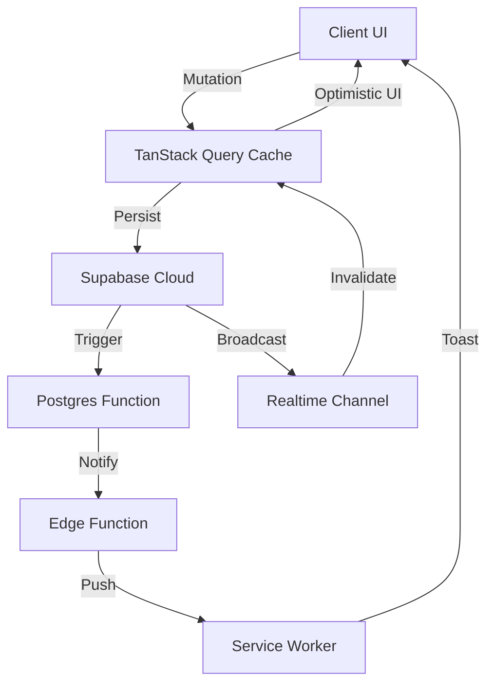

<div align="center">
  

  # TakeAPeek 👀
  **Discover the Unfiltered. Connect in the Glow.**
  
  [](https://www.gnu.org/licenses/agpl-3.0)
  [](https://vitejs.dev/)
  [](https://reactjs.org/)
  [](https://supabase.com/)
  [](https://tailwindcss.com/)
  [](https://vitest.dev/)

  ---

  [Live Demo](https://take-apeek-gbvwcfi2y-raj-s-projects-40feb981.vercel.app/) • [Report Bug](https://github.com/rajdangi31/takeApeek/issues) • [Request Feature](https://github.com/rajdangi31/takeApeek/issues)

</div>

## 📖 The Vision

**TakeAPeek** is a real-time social discovery platform designed for intimate circles and high-fidelity interactions. Built with a **"Glass & Glow"** design system, it bridges the gap between minimalist aesthetics and serverless engineering.

> [!IMPORTANT]
> This project is a technical showcase of web engineering, focusing on real-time data synchronization, polymorphic caching, and cinematic motion physics.

---

## ✨ Feature Cinematic

### 🌍 Social Discovery
- **3-Column Architecture**: Fixed professional navigation, central liquid-feed, and a discovery-focused right sidebar.
- **Infinite Horizon**: Seamless infinite scrolling powered by windowed fetching for sub-second performance.
- **Re-peeking**: A native re-sharing mechanism that preserves original author credit while expanding discovery.

### 👤 Identity & Interaction
- **Dynamic Profiles**: High-fidelity personal hubs with real-time identity management (Bio, Display Name, Grid View).
- **Threaded Conversations**: Recursive multi-level comments with visual thread-nesting and cinematic collapse logic.
- **Real-time Pulse**: Instant likes, comment counters, and friend activity badges synchronized across all devices.

### 🔐 Infrastructure & Security
- **Auth Gateway**: Cinematic Google OAuth entry point with protected social guarding.
- **Push Intelligence**: Proactive VAPID notifications via Supabase Edge Functions.
- **Strict RLS**: Military-grade database privacy policies ensuring your peeks stay between friends.

---

## 🛠️ The Tech Forge

### Core Engine
- **Frontend**: React 18 + TypeScript (Strict Mode)
- **Build Tool**: Vite 6 (ESBuild optimization)
- **Styling**: Tailwind CSS v4 (Leveraging HSL tokens & fluid sizing)
- **State Mgmt**: TanStack React Query v5 (Optimistic updates & windowed caching)

### Backend & Logic
- **Database**: Supabase (PostgreSQL with Denormalized triggers)
- **Real-time**: Supabase Channels (Broadcast & DB Change Listeners)
- **Cloud logic**: Supabase Edge Functions (Deno Runtime)
- **Security**: Supabase Auth + Row-Level Security (RLS) policies

### Quality & Motion
- **Animations**: Framer Motion 12 (Spring-based physics, Layout ID transitions)
- **Testing**: Vitest + JSDOM (@testing-library/react)
- **CI/CD**: GitHub Quality Guard (Automated Linting, Testing, & Production Build)

---

## 🏗️ System Architecture

### Multi-Directional Flux (Mermaid)



---

## 🚀 Installation & Forge

### 1. Initialize
```bash
git clone https://github.com/rajdangi31/takeApeek.git
cd takeApeek
npm install --legacy-peer-deps
```

### 2. Configure Keys
Create a `.env` in the root and synchronize with your Supabase Project:
```bash
VITE_SUPABASE_URL=your_project_url
VITE_SUPABASE_ANON_KEY=your_anon_key
VITE_VAPID_PUBLIC_KEY=your_vapid_public_key
```

### 3. Database Schema
Execute the following SQL scripts in your Supabase SQL Editor:
1. `takeapeek_supabase_init.sql` (Core Schema & RLS)
2. `phase3_notifications.sql` (Edge Function Triggers)
3. `phase5_repeeks.sql` (Social Sharing Mechanics)

---

## 🛡️ License & Legal

This project is licensed under the **GNU Affero General Public License v3.0 (AGPL-3.0)**.

> [!CAUTION]
> **To the Community**: You are encouraged to study, learn from, and fork this project. However, per the AGPL-3.0 terms, **you MUST provide credit to the original author (Raj Dangi)** and any network-hosted derivative works MUST open-source their own code under the same license. Commercial use without attribution or as closed-source is strictly prohibited.

---

## 👨‍💻 Author

Crafted with high-fidelity heart by **Raj Dangi**.

[LinkedIn](https://www.linkedin.com/in/rajdangi01/) • [Portfolio](https://philosrach.com) • [X / Twitter](https://x.com/philosrach)

---
*TakeAPeek © 2026.*
